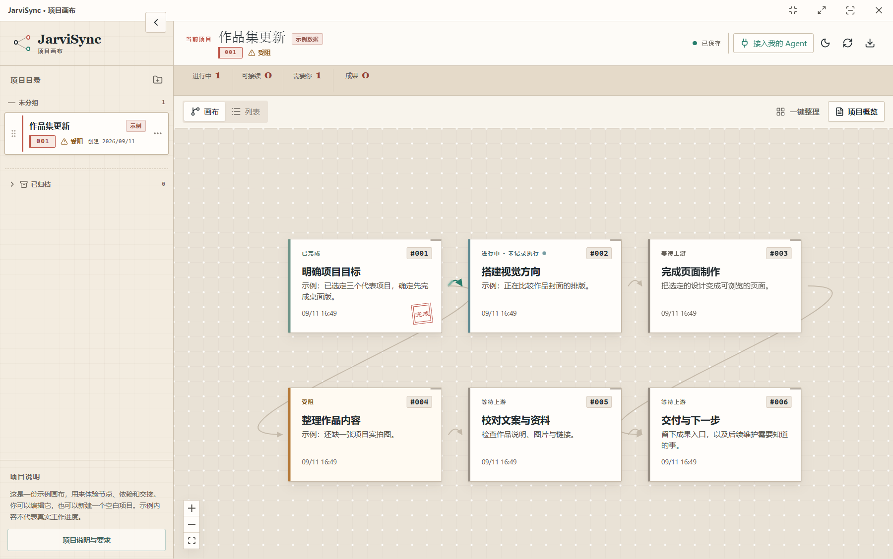

# JarviSync

**A local board that several AI agents share.**

[](https://github.com/jarviseven07-prog/jarvisync/actions/workflows/ci.yml)
[](LICENSE)
[](https://nodejs.org)

[English](README.md) | [中文](README_CN.md)

> **Note:** the interface is currently Chinese-only. The code, APIs and agent
> integrations are language-neutral, but every label you see in the app is in
> Chinese. English localization is not done yet. This early release is tested
> on Windows and macOS; Linux is not verified.

[Download](https://github.com/jarviseven07-prog/jarvisync/releases) ·
[Watch the 30-second workflow demo](https://github.com/jarviseven07-prog/jarvisync/releases/download/v0.1.0/JarviSync-Workflow-30s.mp4)

The video uses a reconstructed UI and a fictional example to illustrate the
workflow. It is not a recording of a live agent run.



---

## The problem

You start three agents on a long task. Ten minutes later you have no idea which
one is where. So you ask each of them, one at a time. Then you copy what A
concluded and paste it into B by hand.

That is the whole problem. Not model quality, not prompting — **the work is
invisible and the context does not move by itself.**

## What JarviSync does

A single local canvas holding projects, nodes and their dependencies.

- **Progress is visible.** Every node shows what was actually done, by whom,
  and what is blocked — because each agent writes its own receipts back.
- **Context is shared.** When node A delivers a result, it stays on the node.
  Node B reads the upstream delivery summary and result links. Referenced files
  are read on demand; the board does not broadcast their full contents.
- **Several projects stay legible.** A summary counts what is running, what is
  unblocked, and what is waiting on you.
- **Any agent can connect.** Integration packages for Codex and Claude Code,
  plus a generic MCP server for every other host. Built for people running
  several agents and several models at once.
- **It is a ladder, not a cage.** The board stores structure; what you build on
  top of it is yours.

The board stores its data on your machine and binds to localhost only. Your
agent host may send content it reads to its model provider; that is governed by
the host and provider settings, not by JarviSync's local storage.

## What it deliberately does not do

This matters more than the feature list, because it is where similar tools
oversell:

- **It does not monitor your agents.** Progress comes from what agents write
  back, rather than process-liveness checks or command-output monitoring. A node
  that looks idle may be an agent that simply has not reported.
- **It does not launch or schedule agents.** `start` and `stop` record receipts;
  the actual starting and stopping is done by your host (Claude Code, Codex…).
  Writing an owner or a model name onto a node does not run anything.
- **It does not pick models or keep a wake-up daemon running.**
- **Browsing and agent reads/writes never call a model.** The board itself does
  no inference.

## Quick start

Version 0.1.3 turns the interface monochrome, the way an e-ink panel renders,
and is the first release verified on macOS.

**Monochrome, and easier to sit with.** Light is warm paper, dark is the same
sheet inverted, and both run on one grey ramp with no colour anywhere. Status is
carried by lightness instead of hue — in progress is the darkest, done the
faintest — and every node already spells out 进行中 / 受阻 / 已完成 in words,
so nothing is lost with the colour.

**macOS support.** The desktop shell, the board service and agent onboarding all
run on macOS. `npm run package:desktop` now builds for the host platform and
produces a `JarviSync.app` with its own name and icon. Windows buttons give way
to the native traffic lights, and the Claude Code and Codex executables are found
where macOS installs them.

**A silent failure, fixed.** The check for "is this file the entry point" did not
resolve symlinks, and macOS points `/var` at `/private/var`. The MCP server, the
hooks and the board service were all affected: the process would start, run no
main function, and report nothing. Windows never hits this.

**Hook session events never reached the board (since 0.1.1).** Writing the
session cache back, the hook dynamically imported itself — while running as the
process entry, still suspended in the top-level await that was waiting on that
very write. The two waited on each other until the 2-second network budget ran
out: the hook reported a timeout, entered its 60-second offline cooldown, and no
session event ever reached the board, so onboarding kept reporting that no native
session entry had arrived. The mechanism is platform-independent; 0.1.1 and 0.1.2
are both affected.

The 0.1.3 release ships desktop packages for Windows (x64) and macOS (Apple
silicon). Prefer the original colours? The
[classic build](https://github.com/jarviseven07-prog/jarvisync/releases/tag/v0.1.3-classic)
is identical to 0.1.3 except that it keeps the palette from before the e-ink
change.

Unchanged since 0.1.2: agent-created nodes must declare their upstream nodes, or give an explicit
reason for being independent. Existing graph relationships are preserved.
At supported host events, an active run with no new progress for about ten
minutes gets a prompt to review milestones; the agent still decides whether
there are real facts to report. No progress or completion is fabricated.

When upgrading, close the old app, back up its data directory, and extract the
new ZIP into a separate directory. In **接入我的 Agent** (Connect my Agent),
refresh the installed integration and reload it in the host so the new tools
and hooks are loaded. Keep the backup if you need to return to an older version.

**Windows x64 portable app:** download `JarviSync-v0.1.3-windows-x64.zip` from the
[v0.1.3 release](https://github.com/jarviseven07-prog/jarvisync/releases/tag/v0.1.3),
extract the entire archive, and open `JarviSync.exe` inside. Keep the extracted
files together. The app bundles its runtime, so no separate Node.js is needed; it
is unsigned, so if SmartScreen stops the first launch, choose More info → Run anyway.

**macOS (Apple silicon):** download `JarviSync-v0.1.3-macos-arm64.zip` from the
[v0.1.3 release](https://github.com/jarviseven07-prog/jarvisync/releases/tag/v0.1.3),
extract it, and drag `JarviSync.app` into Applications. The app is not notarized,
so the first launch is blocked: open System Settings → Privacy & Security and
choose Open Anyway. Intel Macs have no prebuilt package yet; build from source as
below, then run `npm run package:desktop`.

**From source:** requires **Git and Node.js 24+**. Run these commands in a terminal:

```bash
git clone https://github.com/jarviseven07-prog/jarvisync.git
cd jarvisync
git checkout main
npm ci
npm run build
```

**Web board** — data lives in `data/board.json`:

```bash
npm run start:server
```

Then open <http://127.0.0.1:4317>.

**Desktop app** (Electron) — data lives in `%APPDATA%/Nodeboard/data`:

```bash
npm start
```

The two modes keep separate data directories. For the web server,
`NODEBOARD_DATA_DIR` overrides the data directory. For the desktop app,
`NODEBOARD_DESKTOP_DATA_DIR` overrides the app profile directory; board data is
stored in its `data/` subdirectory. On first run you get a clearly-labelled
sample project; new projects start empty.

For development, run the server first, then in another terminal:

```bash
npm run dev:web
```

## Connecting your agents

Open **接入我的 Agent** (Connect my agent) in the top right, pick your host and
recording scope, then install. `integrations/` ships packages for:

| Host | Mechanism |
|---|---|
| Claude Code | plugin + MCP |
| Codex | plugin + MCP |

These are adapter packages, not a claim that every host and model has passed a
real new-session workflow. Host trust, installation and a read/write check are
required in your own environment; see the
[verification scope](docs/agent-onboarding.md#验证范围). Generic stdio MCP supplies
tools without native session hooks. An agent running on a remote machine cannot
connect directly to your localhost server.

Day to day, agents use the JarviSync MCP tools inside their host. There is also
a CLI:

```bash
npm run agent -- projects
npm run agent -- context <projectId> --project
```

Writes require an installed connection file and a real host session — see
[docs/agent-onboarding.md](docs/agent-onboarding.md) for setup and
[docs/agent-collaboration.md](docs/agent-collaboration.md) for the collaboration
contract.

Every write carries the revision it read. On a conflict, re-read the context and
decide — do not blindly retry.

## How the work actually flows

1. A human confirms the goal and the main tasks in a normal chat with their agent.
2. That agent creates the project, the nodes and the dependencies, and records
   where the conversation came from.
3. Executing agents read their node's context, record that they started, write
   progress, and deliver results.
4. Downstream nodes read upstream results and continue.

Node titles, status, owner, model, progress, decisions and dependencies are
read-only in the web UI — they are maintained by agents through the local API.
The **你的补充** (your notes) panel is where a human adds goals, constraints,
materials, feedback or decisions directly, with file attachments.

## FAQ

**Can several agents share one repository or one task?**
Not recommended. Give them separate angles or re-run the task instead. Two
agents editing the same files at the same time is a conflict generator, and the
board cannot prevent it.

**Does an idle-looking node mean the agent died?**
No. It means nothing was written back. The board reports receipts, not liveness.

**Where is my data?**
`data/board.json` plus `uploads/`, `history/`, `instance.json` and
`agent-integrations/` in the same directory. A full backup means the whole data
directory — the in-app JSON export deliberately excludes attachment originals.

## Tests

```bash
npm test
npm run build
```

`npm test` covers persistence, revision conflicts, the CLI, execution receipts,
delivery hand-off, source boundaries, the collaboration summary, layout and
human input. `npm run build` type-checks and builds the page.

## Built with

React · React Flow · Vite · Electron · Node.js with JSON persistence. No
database, no cloud, no telemetry.

## License

[MIT](LICENSE)
